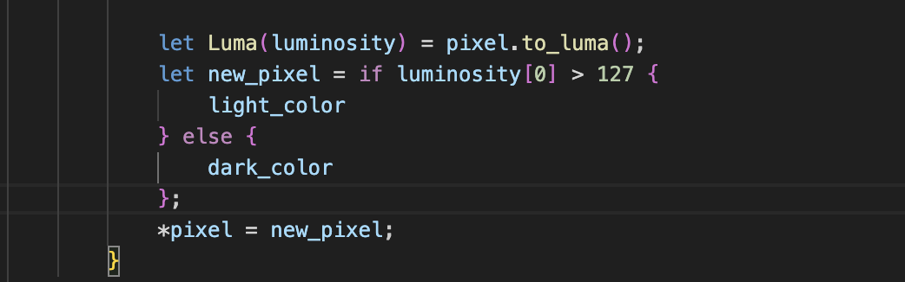

#Rapport TP programation avancé#

                         Partie 1 : 1 La bibliothèque image

Question 2 : 

	Le type DynamicImage permet de travailler avec une image dont le format peut varier notamment avec la couleurs,ou encore niveaux de gris.

	Et donc afin obtenir une image avec 3 canaux RGB représentés par des u8, on utilise .to_rgb8().

Question 3 : 

Si l'image de départ avait un canal alpha, la methode .to_rgb8(). aurait totalement ignoré le canal alpha, il aurait pas consequent totalement disparu.

De plus les pixels transparent seront opaque. 

Question 5 : 

L'image reste tout de même reconaissable même si les details ne sont plus du tout net.

                Partie 2 : Passage en monochrome par seuillage

Question 6 et 7 : 

Afin de récupérer la luminisité d'un pixel, nous avons utilisé la méthode to_luma() qui est fournie dans la bibliothéque image.
Cette methode permet de convertir un pixel de type Rgb <u8> en une valeur de luminosité qui est donc encapsulée dans un type Luma.

Donc la luminosité d’un pixel est calculée avec pixel.to_luma(), cette fonction renvoie une valeur pondérée des composantes RGB.

	•	La luminosité est ensuite utilisée pour décider si le pixel sera clair ou sombre, selon un seuil défini se seuil à été défini ici à >127.

Question 8 : 

La mode  seuil ne comprenait pas d'option qui permet à l'utilisateur de spécifier un type de couleur, foncé ou clair, ou de changer l'image en noir ou en blanc. 
Nous avons donc creer ses options : 

Dans une variable default, nous avons mis du blanc et du noir comme demandé dans la question puis nous avons étendu cela à tous les panels de couleur grace au parse_color.

'' $ cargo run -- image.jpg output.png seuil --dark-color noir --light-color blanc''

Via la ligne de commande il suffit de spécifier "-dark-color" ou "-light-color" (dark oou light) 

La commande pour mettre l'image en noir et blanc : 

'' $ cargo run -- image.jpg output.png seuil --dark-color noir --light-color blanc''

La commande pour mettre d'autre nuance de couleur

'' $ cargo run -- image.jpg output.png seuil --dark-color jaune --light-color vert''

PARTIE 3 : 

Question 9 : 

Afin de calculer la distance entre deux couleurs, nous utilisons la fonction color_distance qui permet de calculer la distance entre deux couleur. 
La methode de calucle utiliser est la distance euclidienne appliqué à notre espace RGB.

